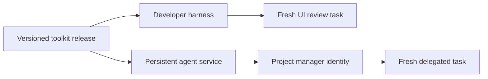

# Architecture

## Definitions and execution

Skills contain expertise. Agent definitions combine a role with selected skills, tool requirements, and expected results. An agent instance is an execution of that definition with an identity, scope, and state. These are separate concepts even when a harness represents several of them in one file.

| Concern      | This repository                       | Runtime service                                 |
| ------------ | ------------------------------------- | ----------------------------------------------- |
| Knowledge    | Canonical SKILL.md and references     | Loads selected content                          |
| Specialist   | Portable role plus native adapters    | Invokes a fresh worker                          |
| Tool         | Jev library/CLI and optional wrappers | Supplies credentials and transport              |
| Identity     | Declares intended scope/lifecycle     | Enforces identity, concurrency, and persistence |
| Distribution | Versioned definitions and artifacts   | Pins and deploys a release                      |

## Harness specialists

A UI reviewer starts with its role, task brief, relevant files, and selected standards. Its context is isolated from unrelated parent discussion. References are loaded only when relevant. It returns findings, evidence, and verification limitations to the parent harness. The harness enforces permissions and creates the context; Markdown cannot guarantee isolation.

## Persistent identity

The intended project-manager identity is scoped per repository, such as `project-manager:owner/repository`. One service can host many identities. A single active coordinator per project may delegate concurrent workers. Durable state is distinct from both a process and a conversation.

A runtime must enforce ownership using a lease/lock with fencing and deduplicate incoming events and dispatched work. Definitions express intent; they do not provide distributed coordination. An event-driven activation can reconstruct bounded context from stored state without continuously running inference.

## Canonical content and adapters

`skills/` and `agents/` are authoritative instruction sources. Adapter output is derived and tested against native harness semantics. Models, permissions, hooks, and discovery locations stay in adapters. Our `catalog.json` describes packaging and selection; its schema is repository-owned, not an industry agent specification.

The bootstrap CLI validates resources and computes selection only. No installation, project inspection, inference, or background work occurs in this release.
