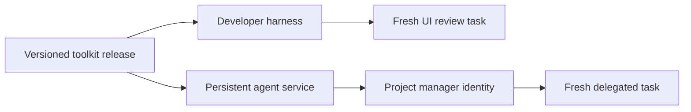

# Architecture

## Definitions and execution

Skills contain expertise. Agent definitions combine a role with selected skills, tool requirements, and expected results. An agent instance is an execution of that definition with an identity, scope, and state. These are separate concepts even when a harness represents several of them in one file.

| Concern      | This repository                     | Runtime service                                 |
| ------------ | ----------------------------------- | ----------------------------------------------- |
| Knowledge    | Canonical SKILL.md and references   | Loads selected content                          |
| Specialist   | Portable role plus native adapters  | Invokes a fresh worker                          |
| Tool         | Jev library and CLI                 | Supplies credentials and transport              |
| Identity     | Declares intended scope/lifecycle   | Enforces identity, concurrency, and persistence |
| Distribution | Versioned definitions and artifacts | Pins and deploys a release                      |

## Harness specialists

A UI reviewer starts with its role, task brief, relevant files, and selected standards. Its context is isolated from unrelated parent discussion. It recovers expertise from its local indexes and targeted searches, then loads relevant topics, lessons, and evidence progressively. It returns findings, evidence, and verification limitations to the parent harness. The harness enforces permissions and creates the context; Markdown cannot guarantee isolation.

## Local expertise

Both agents and skills must own and maintain local `knowledge/` and `memory/` directories under a component root, with small `INDEX.md` files. [The shared convention](local-expertise.md) defines directory layout, search, progressive loading, provenance, and maintenance. Reviewed reusable content is versioned; private working material remains under ignored `local/` directories. A writable scoped component root is separate from the immutable release cache. Operational service state remains in the runtime.

## Persistent identity

The intended project-manager identity is scoped per repository, such as `project-manager:owner/repository`. One service can host many identities. A single active coordinator per project may delegate concurrent workers. Durable state is distinct from both a process and a conversation.

A runtime must enforce ownership using a lease/lock with fencing and deduplicate incoming events and dispatched work. Definitions express intent; they do not provide distributed coordination. An event-driven activation can reconstruct bounded context from stored state without continuously running inference.

## Canonical content and adapters

`skills/` and `agents/` are authoritative instruction sources. Adapter output is derived and tested against native harness semantics. Models, permissions, hooks, and discovery locations stay in adapters. Our `catalog.json` describes packaging and selection; its schema is repository-owned, not an industry agent specification.

The bootstrap CLI validates resources and computes selection only. A separate `jev` executable and `/jev` library export perform explicitly invoked inference. Use the CLI or library directly; this repository does not provide MCP servers. Installing the package supplies the runtime; registering a skill supplies its instructions. No automatic installation, project inspection, or background service runs.

The maintenance runtime separates local version/pin validation, bounded public
release transport, and optional disposable caching. `check` remains read-only;
`poll` writes only its explicitly selected release cache and can be invoked
directly by an external scheduler without inference. Scheduling, notifications,
and host network permissions stay with the consumer, not the package. Neither
command changes pins, downloads runtime assets, or installs an update.
